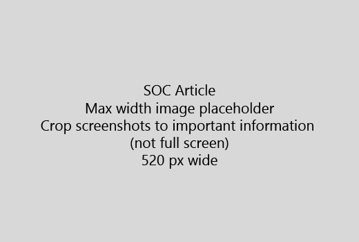

המאמר שלך מתחילים מבוא קצר מאוד (משפט 1). מקם עצמך במקום קורא ה - מדוע שהם כאן? מה עליך לעשות? 
  
1. קבל ישר רשימה מהירה של שלבים כדי להשלים את המשימה.
    
    אם אתה זקוק להסביר רעיון, או שיש להם לביצוע הפעולות הנדרשות מראש, להוסיף תקציר מהיר מתחת לשלב בו הם זקוקים ואת [הקישור](https://support.office.com/article/f37e7984-cf03-4fde-92d3-82970d7e241b.aspx) הרעיון או שלבים. 
    
2. להשאיר שגרות קצר - שלבים רצוי 5 או פחות, לא יותר מ- 8.
    
3. השתמש **בסגנון ממשק המשתמש** עבור רכיבים של ממשק משתמש או עבור טקסט אנשים צריכים להזין. 
    
4. שימוש בפעלים בחר, בחר, או להזין כ פעולות, ועצב תפריטים **כתפריט** \> **הפקודה**.
    
5. באופן אופציונלי, הוסף צילום מסך עבור הקשר (אם ממשק המשתמש קשה לאתר, או היא נדרשת להשלים את המשימה).
    
    רוחב מרבי: 520 פיקסלים. נעשה שימוש בערכת נושא רגיל, לא להציג כל מידע אישי, ו לחתוך כדי להציג רק מה שהיה רלוונטי. 
    
    
  
אם ברצונך להוסיף וידאו או צילום מסך, להשתמש ברשת עמודה שני ולגרום בשלבי שמאלה ווידאו או צילום מסך בפינה הימנית - ראה [שלבים ודוגמה רשת וידאו](https://support.office.com/article/14ce8e82-efa0-47f5-bb84-94f078db3dae.aspx). 
  
יעד לא יותר מ- 500 מילים למאמר.
  
# מאמר לדוגמה

[שינוי התמונות שלי](https://support.office.com/article/555376e0-1fca-49ba-8434-307a0525c767.aspx)
  

