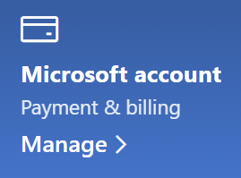

# שינוי פרטי חשבון Microsoft שלי

עבור אל [https://account.microsoft.com](https://account.microsoft.com/) והיכנס אם יש צורך. הפעולה זו תעביר אותך אל העמוד הראשי של החשבון שלך.  

**עריכת השם והמידע האישי שלי**

1. בלוח המחוונים של החשבון שלך, לצד תמונת החשבון ואת השם שלך, לחץ על שלוש הנקודות (פעולות נוספות) > ערוך פרופיל**.
2. בדף **עריכת פרופיל**, השתמש בקישורים שסופקו כדי לשנות את תמונת הפרופיל, השם, תאריך הלידה, המיקום ושפת התצוגה. שים לב לקישורים לפרופילים של חשבונות Xbox או Skype שלך, שבהם תוכל לשנות פרטים ספציפיים לחשבונות אלה.

**ניהול כתובות דואר אלקטרוני ומספרי טלפון**

לחשבון Microsoft משויכים כתובת דואר אלקטרוני אחת או יותר או מספר טלפון אחד או יותר בתור "כינויים". כדי לנהל את המכשירים הללו:

1. בלוח המחוונים של החשבון שלך, לצד תמונת החשבון ואת השם שלך, לחץ על שלוש הנקודות (פעולות נוספות) > **ערוך פרופיל**.
2. בדף **עריכת פרופיל**, לחץ על **ניהול אופן הכניסה ל- Microsoft**. 
3. תראה רשימה של כינויי חשבון שאפשר לנהל, כולל הוספה ומחיקה של כתובות דואר אלקטרוני ומספרי טלפון. כאן תוכל גם לבחור אילו כינויים יכולים לשמש ל כניסה לחשבון, איזה כינוי נחשב ל"ראשי", שיוצג במכשירי Windows 10 שלך.

**ניהול שיטות תשלום וכן שם וכתובת לחיוב** 

1. בלוח המחוונים של החשבון שלך, לצד תמונת החשבון ואת השם שלך, לחץ על שלוש הנקודות (פעולות נוספות) > **ערוך פרופיל**.
2. באזור **פרטי תשלום וחיוב** לחץ על **ניהול**.

    

3. כאן תוכל להוסיף, לערוך ולהסיר שיטות תשלום ואת הכתובות לחיוב המשויכות שלהן. 
