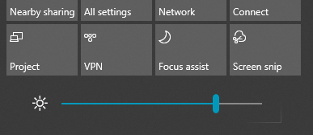

# שינוי בהירות המסך ב- Windows 10

אם Windows 10 שלך חדש יותר מגירסה 1903, הוא כולל **מחוון בהירות** במרכז הפעולות. כדי לפתוח את מרכז הפעולות, **לחץ** על לחצן הודעה בצד השמאלי ביותר של שורת המשימות, או הקש Windows home **+ A** בלוח המקשים.

אם Windows 10 שלך הוא גירסה קודמת, תוכל למצוא את מחוון הבהירות על-ידי **[> הגדרות > תצוגה](ms-settings:display?activationSource=GetHelp)**.

**הערות**:

- ייתכן שלא תראה את מחוון שינוי הבהירות עבור מחוון התצוגה המוכלל במחשבים שולחניים עם צג חיצוני. כדי לשנות את הבהירות של צג חיצוני, השתמש בפקדים בצג.
- אם אין לך מחשב שולחני, המחוון אינו מופיע או פועל, נסה לעדכן את מנהל התצוגה. בתיבת החיפוש שבשורת המשימות, הקלד **מנהל ההתקנים** ולאחר מכן בחר **מנהל ההתקנים** מרשימת התוצאות. במנהל **ההתקנים,** בחר **מתאמי תצוגה** ולאחר מכן בחר את מתאם התצוגה. לחץ והחזק (או לחץ באמצעות לחצן העכבר הימני) על שם מתאם התצוגה ולחץ על **עדכן מנהל התקן**; לאחר מכן בצע את ההוראות.
