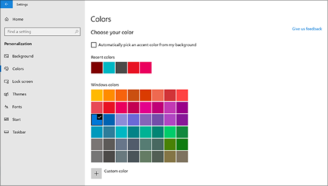
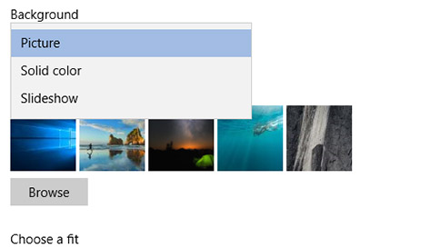

# שינוי רקע שולחן העבודה וצבעים

כדי לשנות את הגדרת הצבעים, עבור אל **התחל** הגדרות צבעי התאמה אישית ולאחר מכן בחר צבע משלך או תן  >    >    >  ל- Windows למשוך צבע הדגשה מהרקע שלך.

כדי לשנות את רקע שולחן העבודה, עבור אל **התחל** הגדרות רקע התאמה אישית ולאחר מכן בחר  >    >    >  תמונה, צבע מלא או צור הצגת שקופיות של תמונות. 

מעוניין ברקעי שולחן עבודה וצבעים נוספים? בקר [ב- Microsoft Store](https://www.microsoft.com/store/collections/windowsthemes) כדי לבחור מתוך עשרות ערכות נושא ללא תשלום.
