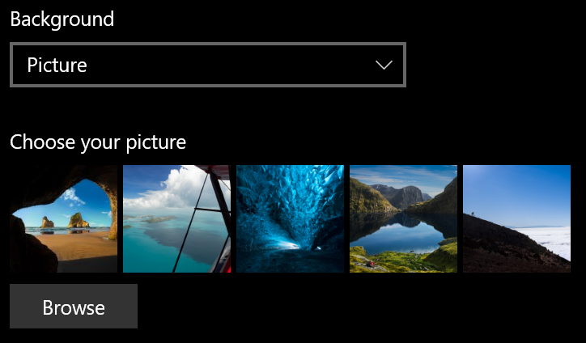
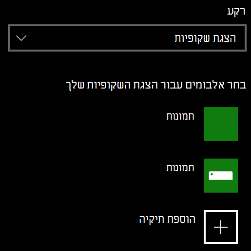

# שינוי רקע מסך הנעילה

- עבור **למסך נעילת****התאמה אישית** >של **הגדרות** > . או לחץ כאן או הקש [כאן](ms-settings:lockscreen?activationSource=GetHelp).

- כדי להגדיר תמונת רקע מותאמת אישית, בחר ' **תמונה** ' מתוך הרשימה הנפתחת ' **רקע** ', ובחר או **דפדף** לתמונה.

  

- כדי להגדיר שקופיות של תמונות מותאמות אישית, בחר **שקופיות** מתוך הרשימה הנפתחת **ברקע** , ובחר אלבום או הוסף תיקיה המכילה את התמונות עבור הצגת השקופיות.

  
