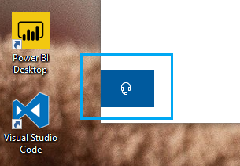

# צור איתנו קשר על-ידי לחיצה על לחצן האוזניותContact us by clicking the headphone button

אם אתה רוצה לפנות לתמיכה של Microsoft, לחץ **על צור קשר** בפינה הימנית התחתונה של יישום זה.If you'd like to contact Microsoft Support, please click **Contact us** in the lower left corner of this app. בתוך החלון הנ נשלף, תודרך לערוץ התמיכה הנכון לאחר בחירת קטגוריית המוצר והבעיה שלך.Inside the fly-out window, you will be guided to the right support channel after choosing your product and issue category.

באפשרותך להמשיך לקיים אינטראקציה עם שאר היישום גם לאחר הפעלת יצירת קשר.You can keep interacting with the rest of the app even after you have initiated a Contact us session. ניתן למזער את החלונית צור קשר באופן זמני על-ידי לחיצה במקום אחר בתוך האפליקציה.The Contact us panel can be temporarily minimized by clicking anywhere else inside the app. כדי לחזור לאותה הפעלה, פשוט לחץ **שוב על צור** קשר.To return to the same session, just click **Contact us** again.
