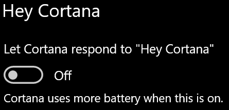

# קורטנה לא מדברת איתי או לא יכולה לשמוע אותיCortana doesn’t talk to me or can’t hear me

אם אתה מנסה להשתמש בתכונה "היי Cortana", אשר מאפשר לך לדבר עם Cortana מבלי לבחור את כפתור Cortana בשורת המשימות או לחצן המיקרופון בחלונית Cortana, לוודא כי התכונה מופעלת:If you are trying to use the "Hey Cortana" feature, which allows you to talk to Cortana without selecting the Cortana button on the taskbar or the microphone button in the Cortana panel, confirm that the feature is enabled:

1. עבור **להתחלה**ולאחר מכן בחר **[הגדרות _ Gticortana](ms-settings:cortana?activationSource=GetHelp)**.Go to **Start**, then select **[Settings > Cortana](ms-settings:cortana?activationSource=GetHelp)**.
2. תחת **היי קורטנה**, החלף את **הרשה קורטנה להגיב ל-"היי קורטנה"** לעבור **.**Under **Hey Cortana**, switch the **Let Cortana respond to "Hey Cortana"** toggle to **On**.

**האם הגדרות הפרטיות שלך מונעות מקורטנה לשמוע אותך?****Are your privacy settings preventing Cortana from hearing you?**

הגדרות הפרטיות שלך יכולות למנוע מקורטנה להגיב לקולך.Your privacy settings can prevent Cortana from responding to your voice.
- ודא שזיהוי דיבור מקוון מופעל:Check to make sure Online Speech recognition is turned on:
    - עבור **להתחלה**ולאחר מכן לחץ על **[הגדרות _ gt_ פרטיות _ הדיבור](ms-settings:privacy-speech?activationSource=GetHelp)**.Go to **Start**, then click **[Settings > Privacy > Speech](ms-settings:privacy-speech?activationSource=GetHelp)**.
    - תחת **זיהוי דיבור מקוון**, העבר את **ההגדרה ל-**.Under **Online speech recognition**, switch the setting to **On**.
- ודא שלקורטנה יש הרשאה לגשת למיקרופון שלך.Check to make sure Cortana has permission to access your microphone. 
    - עבור אל התחלה ולאחר מכן לחץ על **[הגדרות _ Gt_ פרטיות _ gt_ מיקרופון](ms-settings:privacy-microphone?activationSource=GetHelp)**.Go to Start, then click **[Settings > Privacy > Microphone](ms-settings:privacy-microphone?activationSource=GetHelp)**.
    - תחת **לבחור אילו יישומים יכולים לגשת למיקרופון שלך**, לחפש **cortana** בתוך רשימת היישומים והשירותים וודא כי המתג **הוא החליף כדי.**Under **Choose which apps can access your microphone**, look for **Cortana** within the list of apps and services and make sure the switch is toggled to **On**.

יתר על כן, בבקשה לוודא גם הרמקולים שלך או מיקרופונים הם למעלה ולעבוד כדי לדבר עם Cortana.Moreover, please also make sure that your speakers or microphones are up and working in order to talk to Cortana.
