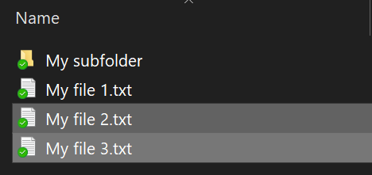
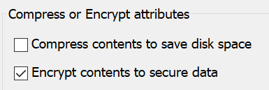

# הצפנת קבצים או תיקיה ב- Windows 10Encrypt files or folder in Windows 10

באפשרותך להצפין דיסק שלם באמצעות BitLocker, אך כדי להצפין קבצים או תיקיות בודדים בלבד (ואת התוכן שלהם):You can encrypt an entire disk using BitLocker, but to encrypt only individual files or folders (and their contents):

1. בסייר **הקבצים,** בחר את הקבצים/התיקיות שברצונך להצפין.In **File Explorer**, select the file(s)/folder(s) you want to encrypt. בדוגמה זו, שני קבצים נבחרו:In this example, two files have been selected:

    

2. לחץ באמצעות לחצן העכבר הימני על הקבצים שנבחרו ולחץ **על מאפיינים**.Right-click the selected files and click **Properties**.

3. בחלון **מאפיינים,** לחץ על **מתקדם**.In the **Properties** window, click **Advanced**.

4. בחלון **מאפיינים מתקדמים,** בחר את תיבת **הסימון הצפן תוכן כדי לאבטח** נתונים:In the **Advanced Properties** window, select the **Encrypt contents to secure data** checkbox:

    

5. לחץ על **אישור**.Click **OK**.
