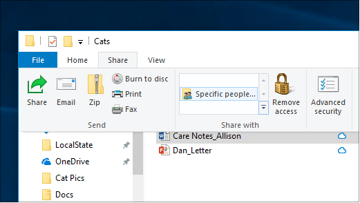
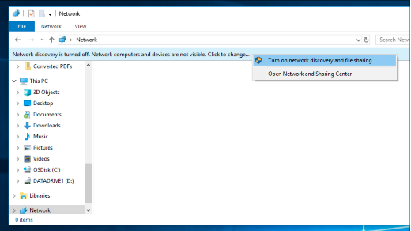

# שיתוף קבצים ברשת ב-Windows 10File sharing over a network in Windows 10

**הערה**: אם השתמשת בעבר בקבוצה ביתית עבור שיתוף קבצים, שים לב שקבוצה ביתית הוסרה מ-Windows 10 (גירסה 1803).**Note**: If you previously used HomeGroup for file sharing, please note that HomeGroup has been removed from Windows 10 (Version 1803). כעת באפשרותך לשתף מדפסות וקבצים על-ידי שימוש בתכונות מוכללות ב-Windows 10.You can now share printers and files by using built-in features in Windows 10.

**כדי לשתף קבצים או תיקיות ברשת****To share files or folders over a network**

- **בסייר הקבצים**, בחר קובץ > לחץ על הכרטיסיה **שיתוף** בחלק העליון של > במקטע **שתף עם** , לחץ על **אנשים ספציפיים**.In **File Explorer**, select a file > click the **Share** tab at the top > in the **Share with** section, click **Specific people**.

    
          
- אם אתה בוחר קבצים מרובים בו, באפשרותך לשתף את כולם באותו אופן.If you select multiple files at once, you can share them all in the same way. היא פועלת גם עבור תיקיות.It works for folders, too.

**כדי לראות מכשירים ברשת שמשתפים קבצים****To see devices on the network that are sharing files**

- **בסייר הקבצים**, עבור אל **רשת**.In **File Explorer**, go to **Network**. אם גילוי רשת אינו זמין, תראה הודעת שגיאה "גילוי רשת מבוטלת..."If Network discovery is not enabled, you will see an error message "Network discovery is turned off..."

- לחץ על **גילוי הרשת מבוטל** כרזה ולאחר מכן לחץ על **הפעל גילוי רשת ושיתוף קבצים**.Click the **Network discovery is turned off** banner, then click **Turn on network discovery and file sharing**.

    

[קרא עוד אודות שיתוף קבצים ברשתRead more about file sharing over a network](https://support.microsoft.com/help/4092694/windows-10-file-sharing-over-a-network)

[שיתוף קבצים באמצעות אפליקציות, OneDrive, הודעות דואר אלקטרוני ועודShare files using apps, OneDrive, emails, and more](https://support.microsoft.com/help/4027674/windows-10-share-files-in-file-explorer)
