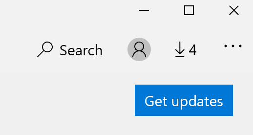

# תיקון שפת התצוגה של יישומים

לאחר שינוי שפת התצוגה ב-Windows 10, ייתכן שיישומים מסוימים עדיין ישתמשו בשפה הקודמת בעת פתיחתם. פעולה זו מתבצעת מאחר שניתן להוריד גירסאות חדשות של היישומים עבור שפה זו מהחנות. כדי לפתור בעיה זו, באפשרותך להמתין לעדכון האוטומטי, או להתקין באופן ידני את הגירסה המעודכנת של היישומים.

כדי להתקין את העדכון באופן ידני, פתח את **Microsoft Store** ולחץ על **הורדות ועדכונים** בפינה השמאלית העליונה. לאחר מכן לחץ על **קבל עדכונים**. אם השפה אינה משתנה לאחר השלמת העדכון, נסה להפעיל מחדש את המחשב.

כדי לקרוא מידע נוסף אודות הגדרות שפת הקלט והתצוגה, ראה [ניהול הגדרות הקלט והצגת השפה ב-Windows 10](https://support.microsoft.com/help/4027670/windows-10-add-and-switch-input-and-display-language-preferences).
