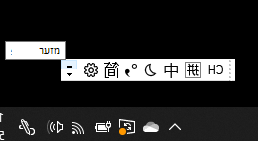
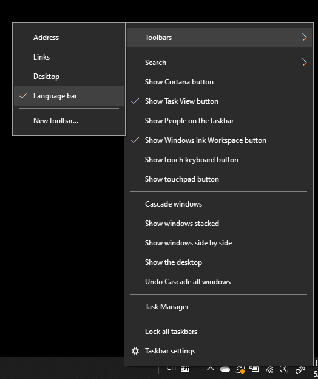
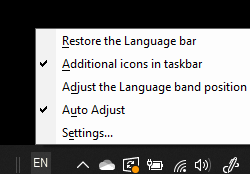

# הסתרה, הצגה או איפוס של סרגל השפה

**כדי למזער את סרגל השפה:**

באפשרותך ללחוץ על לחצן מזעור בפינה השמאלית העליונה של סרגל השפה. לחלופין, באפשרותך פשוט לגרור את סרגל השפה אל סרגל המשימות, אשר ימזער אותו באופן אוטומטי.

**כדי לקפץ את סרגל השפה:**

אם אינך מעוניין לעגן את סרגל השפה בשורת המשימות, לחץ באמצעות לחצן העכבר הימני על שטח ריק בשורת המשימות ו בטל את הסימון באפשרות **סרגל** השפה בתפריט סרגלי כלים. פעולה זו תגרום לס סרגל השפה להופיע מחוץ לשורת המשימות, בדיוק כמו צילום המסך הקודם.

**כדי לשחזר את סרגל השפה לברירת המחדל:**

לחץ באמצעות לחצן העכבר הימני על לחצן השפה בסרגל הכלים ולחץ **על שחזר את אפשרות** סרגל השפה בתפריט. פעולה זו תשחזר אותה לברירת המחדל.

