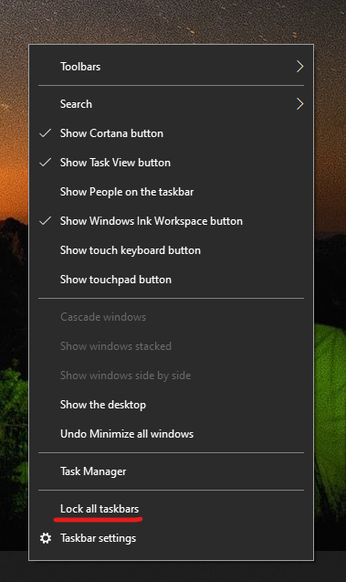

# העברת שורת המשימות לצד או לראש שולחן העבודה

תחילה, ודא ששורת המשימות אינה נעולה. כדי לגלות אם הנעילה שלך אינה נעולה, לחץ באמצעות לחצן  העכבר הימני על שטח ריק כלשהו בשורת המשימות ובדוק אם לצדה לנעול את שורת המשימות יש סימן ביקורת. אם יש סימן ביקורת, שורת המשימות נעולה ולא ניתן להעביר אותה. לחיצה על **נעל את שורת המשימות** פעם אחת תבטל את נעילתה ותסיר את סימן הסימון.

אם יש לך צגים מרובים המציגים את שורת המשימות, תראה את נעילת **כל שורת המשימות.**

לאחר ביטול הנעילה של שורת המשימות, באפשרותך להקיש ולהחזיק כל שטח ריק בשורת המשימות ולגרור אותה למיקום הרצוי על המסך. באפשרותך גם לעשות זאת על-ידי לחיצה באמצעות לחצן העכבר הימני על כל שטח ריק בשורת המשימות ול עבור ** אל הגדרות שורת המשימות > שורת המשימות על המסך**.
