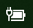

# סמל הסוללה או החשמל חסר ב- Windows 10Power or battery icon missing in Windows 10

אם במכשיר Windows 10 יש סוללה (לדוגמה, מחשב נישא או טאבלט או מחשב PC המחובר באמצעות USB ל- UPS), סמל מצב החשמל/סוללה מוצג בדרך כלל בשורת המשימות ליד השעון, לדוגמה:If your Windows 10 device has a battery (e.g., laptop or tablet, or a PC connected via USB to a UPS), normally a power/battery icon is shown in the taskbar near the clock, for example:

אם אינך רואה את הסמל, ייתכן שהוא מוסתר:If you don't see this icon, it may be hidden:

1. עבור אל **[ההגדרות > התאמה אישית > שורת המשימות](ms-settings:taskbar?activationSource=GetHelp)**.Go to **[Settings > Personalization > Taskbar](ms-settings:taskbar?activationSource=GetHelp)**.

2. באזור ההודעות, לחץ על **בחר אילו סמלים יופיעו בשורת המשימות**.In the Notification area, click **Select which icons appear on the taskbar**.

3. לאחר מכן, מצא את פריט ה **חשמל** ברשימה והחלף את ההגדרה שלו ל- **פועל**.Then find the **Power** item in the list and toggle its setting to **On**.

    

**פתרון בעיות****Troubleshooting**

אם ההוראות שלעיל והלחצן הדו-מצבי **חשמל** מופיע באפור או אינו גלוי, בתיבת החיפוש בשורת המשימות, הקלד **מנהל ההתקנים** ולאחר מכן בחר **מנהל ההתקנים** ברשימת התוצאות.If you followed the above instructions and the **Power** toggle is greyed out or not visible, in the search box on the taskbar, type **device manager**, and then select **Device Manager** in the list of results. באזור **סוללות**, לחץ באמצעות לחצן העכבר הימני על הסוללה עבור המכשיר שלך, לחץ על **הפוך ללא זמין** ולאחר מכן לחץ על **כן**.Under **Batteries**, right-click the battery for your device, click **Disable**, and click **Yes**. המתן כמה שניות ולאחר מכן לחץ באמצעות לחצן העכבר הימני על הסוללה ולחץ על **הפוך לזמין**.Wait a few seconds, and then right-click the battery and click **Enable**. לאחר מכן הפעל מחדש את המכשיר.Then restart your device.

אם בצעת את ההוראות לעיל, אך סמל הסוללה לא מופיע בשורת המשימות, בתיבת החיפוש בשורת המשימות, הקלד **מנהל המשימות** ולאחר מכן לחץ על **מנהל המשימות** ברשימת התוצאות.If you followed the above instructions, but the battery icon does not appear on the taskbar, in the search box on the taskbar, type **task manager**, and then click **Task Manager** in the list of results. בכרטיסיה **תהליכים**, תחת **שם**, לחץ באמצעות לחצן העכבר הימני על **Explorer** ולאחר מכן לחץ על **הפעל מחדש**.On the **Processes** tab, under **Name**, right-click **Explorer**, and then click **Restart**.
