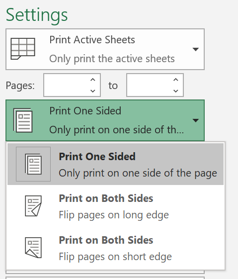
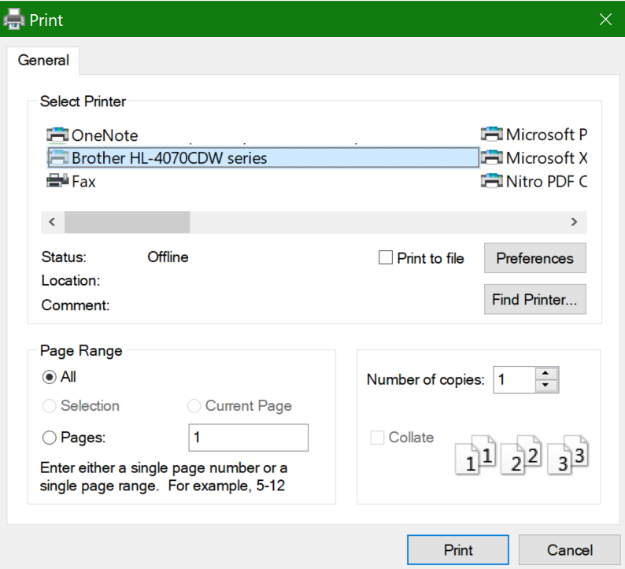

# הדפסה על שני צידי הנייר (הדפסה דו-צדדית)

**האם המדפסת שלי מסוגלת להדפיס דופלקס?**

סיכום התכונות של המדפסת או המדריך אמור לומר לך אם הוא מסוגל להדפיס בשני הצדדים של הנייר, הידוע גם בשם "הדפסה דו-צדדית". אם יש לך Microsoft Office, דרך נוספת לגלות היא על-ידי פתיחת יישום של Office, כגון Word או Excel, הולך **לקובץ _GT_ Print**, ומוודא שהאפשרות מדפסת שמתאימה נבחרה ומחפשת את היכולת במקטע הגדרות. לדוגמה: 

**הדפסת דופלקס ב-Microsoft Office**

אם המדפסת שלך מסוגלת להדפיס בשני הצדדים, כאשר תעבור אל **File _GT_ Print** באפליקציה של Office, תוכל לראות את האפשרות "הדפס משני הצדדים", כפי שמוצג בדוגמה שלעיל.  בחר את סוג ההדפסה הדופלקס הרצוי (הפוך על קצה ארוך, או הפוך לקצה הקצר) ולחץ על **הדפס** כדי להתחיל את התדפיס.

**הדפסת דופלקס מכל יישום**

ביישומים רבים בעת ההדפסה, תראה תיבת דו-שיח כללית של הדפסה שנראית כך: 

ודא שהמדפסת הנכונה נבחרה ולאחר מכן לחץ על **העדפות** כדי לפתוח את חלון העדפות המדפסת. אם המדפסת מסוגלת להדפיס דופלקס, היכולת להפוך אותה לזמינה עבור משימת ההדפסה הנוכחית תופיע בחלון זה.
