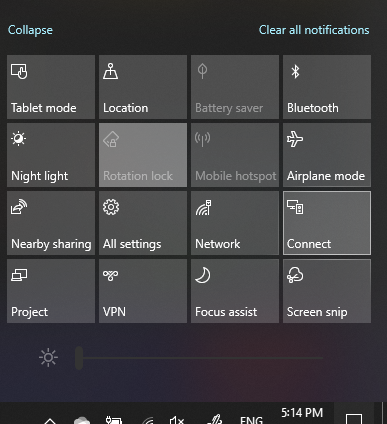

# Project to a PC

במכשיר היעד שלך (הקרנה ל), חפש את "הגדרות הקרנה" כדי לפתוח את הדף הגדרות של **Projecting למחשב זה.** לאחר מכן ודא כי:
- התפריט הנפתח "מכשירי Windows ו- Android מסוימים יכולים לפרוייקט במחשב זה כאשר אתה אומר שזה בסדר" מוגדר **ל'תמיד כבוי'.**
- התפריט הנפתח 'בקש פרוייקט למחשב זה' מוגדר לכל **פעם שנדרש חיבור.**
- התפריט הנפתח 'דרוש מספר זיהוי אישי עבור שיוך' מוגדר כ'לעולם **לא'.**

במכשיר היעד שלך, הפעל את **היישום Connect** על-ידי עבור **אל התחל** וחפש את "Connect".

לאחר מכן, במכשיר המקור שאתה מנסה לפרוייקט ממנו:

1. הקש **על מקש Windows + A כדי** לפתוח את מרכז הפעולות.
2. לחץ **על התחבר**.
3. לחץ על המכשיר שברצונך לפרוייקט את המסך שלו.

לאחר השלבים לעיל, התקן היעד אמור להציג את המסך של התקן המקור כאילו הוא צג משני.
