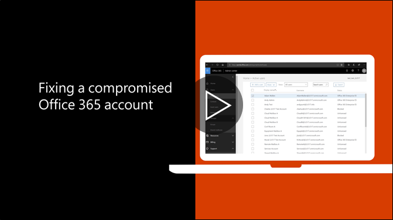

# מומלץ הצעדים שיש לנקוט אם חשבון נפרצתRecommended steps to take if an account is compromised

  
1. [איפוס סיסמת המשתמש](https://support.office.com/article/7a5d073b-7fae-4aa5-8f96-9ecd041aba9c) באופן מיידי. לא לקיים תקשורת עם הסיסמה החדשה באמצעות דואר אלקטרוני למשתמש הקצה.[Reset the user's password](https://support.office.com/article/7a5d073b-7fae-4aa5-8f96-9ecd041aba9c) immediately. Do not communicate the new password through email to the end user. 
    
2. הסר כל חשוד [העברת כתובות](https://support.office.com/article/ab5eb117-0f22-4fa7-a662-3a6bdb0add74) להגדיר ברמת תיבת הדואר.Remove any suspicious [forwarding addresses](https://support.office.com/article/ab5eb117-0f22-4fa7-a662-3a6bdb0add74) set at the mailbox level. 
    
3. הסר כל חשוד [כללי תיבת דואר נכנס](https://support.office.com/article/1433E3A0-7FB0-4999-B536-50E05CB67FED) להגדיר בתוך תיבת הדואר.Remove any suspicious [inbox rules](https://support.office.com/article/1433E3A0-7FB0-4999-B536-50E05CB67FED) set within the mailbox. 
    
4. אם המשתמש נחסמת שליחת דואר אלקטרוני, [לעבור אל משתמשים מוגבלים לבטל את חסימת החשבון](https://protection.office.com/?hash=/restrictedusers). לאחר סיום הפעולה, המשתמש אמור לחדש שליחת הודעות בתוך שעה אחת.If the user is blocked from sending email, [go to the Restricted Users to unblock the account](https://protection.office.com/?hash=/restrictedusers). Once done, the user should be able to resume sending messages within 1 hour.
    
5. הסרת חשבון המשתמש מתוך כל [קבוצות תפקיד ניהול](https://support.office.com/article/eac4d046-1afd-4f1a-85fc-8219c79e1504) עד אתה בטוח החשבון עוד בסכנה.Remove the user account from any [administrative role groups](https://support.office.com/article/eac4d046-1afd-4f1a-85fc-8219c79e1504) until you are confident that the account is no longer compromised. 
    
כדי למזער את הפוטנציאל של פרצה נתונים או חשבון פרוץ בעתיד, אנו ממליצים על קריאת שלנו [מאמר נהלי הטובה ביותר של אבטחה של Office 365](https://support.office.com/article/9295e396-e53d-49b9-ae9b-0b5828cdedc3).To minimize the potential of a data breach or a compromised account in the future, we recommend reading our [Office 365 Security best practices article](https://support.office.com/article/9295e396-e53d-49b9-ae9b-0b5828cdedc3).
  

