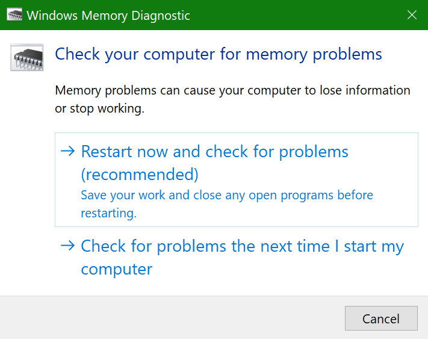
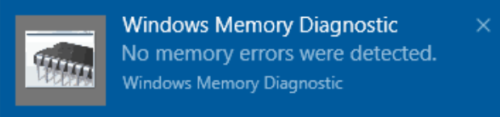

# הפעלת 'אבחון זיכרון של Windows' ב- Windows 10Run Windows Memory Diagnostics in Windows 10

אם Windows ואפליקציות במחשב קורסים, קופאים או פועלים באופן לא יציב, ייתכן שיש לך בעיה בזיכרון המחשב (RAM).If Windows and apps on your PC are crashing, freezing, or acting in an unstable manner, you may have a problem with the PC’s memory (RAM). באפשרותך להפעיל את אבחון הזיכרון של Windows כדי לבדוק אם יתו בעיות בזיכרון ה- RAM של המחשב.You can run the Windows Memory Diagnostic to check for problems with the PC’s RAM.

בתיבת החיפוש בשורת המשימות, הקלד אבחון **זיכרון** ולאחר מכן בחר אבחון **זיכרון של Windows**.In the search box on your taskbar, type **memory diagnostic**, and then select **Windows Memory Diagnostic**. 

כדי להפעיל את האבחון, המחשב צריך להפעיל מחדש.To run the diagnostic, the PC needs to restart. יש לך אפשרות להפעיל מחדש באופן מיידי (שמור את עבודתך וסגור תחילה מסמכים והודעות דואר אלקטרוני פתוחים), או תזמן את האבחון לפעול באופן אוטומטי בפעם הבאה שהמחשב יופעל מחדש:You have the option to restart immediately (please save your work and close open documents and e-mails first), or schedule the diagnostic to run automatically the next time the PC restarts:

כאשר המחשב יופעל מחדש, כלי **אבחון הזיכרון של Windows יופעל** באופן אוטומטי.When the PC restarts, the **Windows Memory Diagnostics Tool** will run automatically. המצב וההתקדמות יוצגו בעת הפעלת האבחון, ויש לך אפשרות לבטל את האבחון על-ידי לחיצה על **מקש ESC** בלוח המקשים.Status and progress will be displayed as the diagnostics run, and you have the option of cancelling the diagnostics by hitting the **ESC** key on your keyboard.

לאחר השלמת האבחון, Windows יתחיל כרגיל.When the diagnostics are complete, Windows will start normally.
מיד לאחר ההפעלה מחדש, כאשר שולחן העבודה מופיע, תופיע הודעה (לצד סמל **מרכז** הפעולות בשורת המשימות), כדי לציין אם נמצאו שגיאות זיכרון כלשהן.Immediately after restart, when the Desktop appears, a notification will appear (next to the **Action Center** icon on the taskbar), to indicate whether any memory errors were found. לדוגמה:For example:

הנה סמל מרכז הפעולות:Here's the Action Center icon:  

והודעה לדוגמה:And a sample notification: 

אם החמצת את ההודעה, באפשרותך לבחור בסמל **מרכז** הפעולות בשורת המשימות כדי להציג את **מרכז** הפעולות ולראות רשימה ניתנת לגלילה של הודעות.If you missed the notification, you can select the **Action Center** icon  on the taskbar to display the **Action Center** and see a scrollable list of notifications.

כדי לסקור מידע מפורט, **הקלד אירוע** בתיבת החיפוש בשורת המשימות ולאחר מכן בחר **מציג האירועים**.To review detailed information, type **event** into the search box on your taskbar, and then select **Event Viewer**. בחלונית **הימנית** של מציג האירועים, נווט אל **יומני הרישום של Windows > מערכת**.In the **Event Viewer**’s left-hand pane, navigate to **Windows Logs > System**. בחלונית השמאלית, סרוק את הרשימה בעת  התסת עמודה, עד שאתה רואה אירועים עם ערך מקור **MemoryDiagnostics-Results**.In the right-hand pane, scan down the list while looking at the **Source** column, until you see events with Source value **MemoryDiagnostics-Results**. סמן כל אירוע כזה ו תראה את פרטי התוצאה בתיבה תחת **הכרטיסיה כללי** מתחת לרשימה.Highlight each such event and see the result information in the box under the **General** tab below the list.
