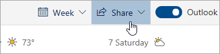

# שיתוף עם Outlook באינטרנט

מלוח השנה שלך, בסרגל הכלים שבראש הדף, בחר באפשרות **שיתוף**ובחר בלוח השנה שברצונך לשתף.

    

**הערה**: לא ניתן לשתף לוחות שנה בבעלות אנשים אחרים.

- הזן את השם או את כתובת הדוא ל של האדם שאיתו ברצונך לשתף את לוח השנה שלך.
- בחר כיצד ברצונך שהאדם ישתמש בלוח השנה שלך:
    - **יכול להציג כאשר אני עסוק**   מאפשר להם לראות כאשר אתה עסוק אך אינו כולל פרטים כגון מיקום האירוע.
    - **יכול להציג כותרות ומיקומים**   מאפשר להם לראות כאשר אתה עסוק, כמו גם את הכותרת והמיקום של אירועים.
    - **יכול להציג את כל הפרטים**   מאפשר להם לראות את כל הפרטים של האירועים שלך.
    - **ניתן לערוך**   מאפשר להם לערוך את לוח השנה שלך.
    - **נציגים**   מאפשר להם לערוך את לוח השנה שלך ולשתף אותו עם אחרים.
- בחר באפשרות **שיתוף**.
