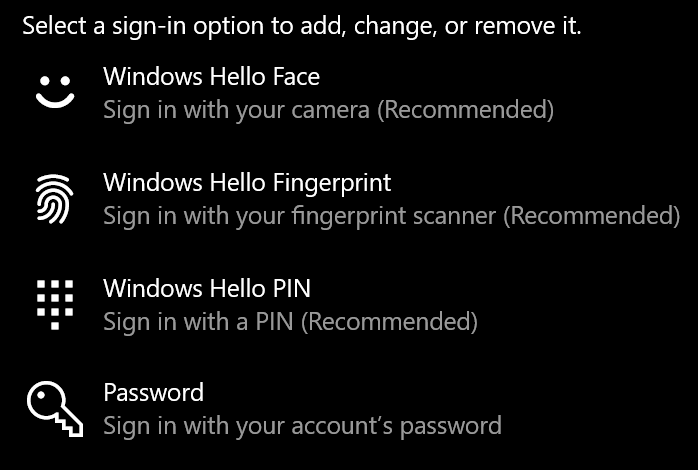
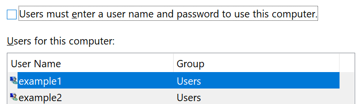

# כניסה ל-Windows 10 ללא שימוש בסיסמהSign-in to Windows 10 without using a password

כדי להימנע מהקלדת סיסמה ב-Windows startup, מומלץ להשתמש באחת מאפשרויות הכניסה המאובטחת של Windows שלום, כגון מספר זיהוי אישי, זיהוי פנים או טביעת אצבע, אם הם זמינים.To avoid having to type a password at Windows startup, we recommend you use one of the Windows Hello secure sign-in options, like a PIN, face recognition, or fingerprint, if available. אם אתה בטוח שברצונך להפוך את הכניסה המאובטחת ללא זמינה, עיין בהוראות "כניסה אוטומטית ל-Windows 10" להלן.If you really want to disable secure sign-in, see the "Automatically sign in to Windows 10" instructions below.

**מאובטח חלופות של Windows שלום לסיסמה של החשבון****Secure Windows Hello alternatives to the account password**

עבור אל **הגדרות חשבונות > > אפשרויות כניסה** (או לחץ [כאן](ms-settings:signinoptions?activationSource=GetHelp)).Go to **Settings  > Accounts > Sign-in options** (or click [here](ms-settings:signinoptions?activationSource=GetHelp)). אפשרויות כניסה זמינות יופיעו.Available sign-in options will be listed. לדוגמה:For example:

לחץ או הקש על אחת מהאפשרויות כדי לקבוע את תצורתה.Click or tap one of the options to configure it. בפעם הבאה שתפעיל או תבטל את הנעילה של Windows, תוכל להשתמש באפשרות החדשה במקום בסיסמה.Next time you start or unlock Windows, you will be able to use the new option instead of a password. 

**כניסה אוטומטית ל-Windows 10****Automatically sign-in to Windows 10**

**הערה**: כניסה אוטומטית היא נוחה, אך מציגה סיכון אבטחה, במיוחד אם המחשב שלך נגיש על-ידי אנשים מרובים.**Note**: Automatic sign-in is convenient, but introduces a security risk, especially if your PC is accessible by multiple people. 

1. לחץ או הקש על לחצן **התחל** בשורת המשימות.Click or tap the **Start** button in the Taskbar.

2. הקלד **netplwiz** ולאחר מכן הקש על מקש Enter כדי לפתוח את החלון ' חשבונות משתמשים '.Type **netplwiz** and hit the Enter key to open the User Accounts window.

3. **בחשבונות משתמשים**, לחץ על החשבון שאליו ברצונך להיכנס באופן אוטומטי כאשר Windows מופעל.In **User Accounts**, click the account you want to automatically sign in to when Windows starts.

4. בטל את הסימון בתיבת הסימון "משתמשים חייבים להזין שם משתמש וסיסמה כדי להשתמש במחשב זה".Uncheck the "Users must enter a user name and password to use this computer" checkbox.

    

5. לחץ על **אישור**.Click **OK**. תתבקש להזין ולאשר את הסיסמה עבור החשבון שבחרת.You will be asked to enter and confirm the password for the account you selected. לחץ על **אישור** כדי לסיים.Click **OK** to finish. בפעם הבאה שחלונות 10 תופעל, היא תיכנס באופן אוטומטי לחשבון שבחרת.Next time Windows 10 starts, it will automatically sign in to the account you selected.
