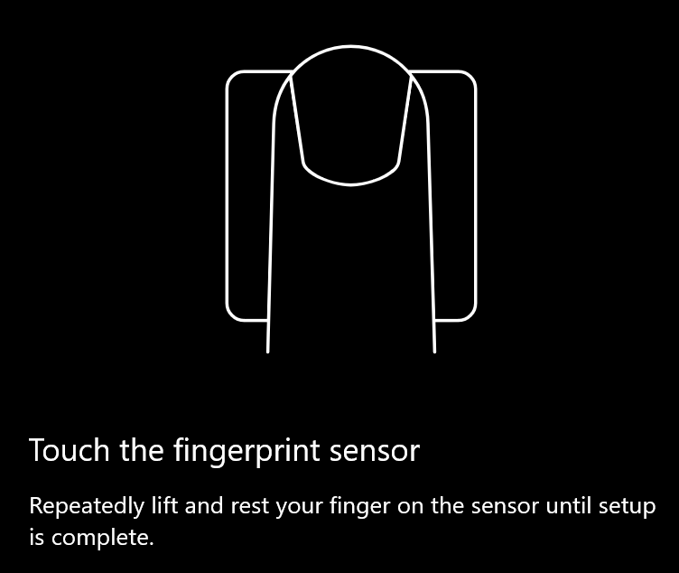
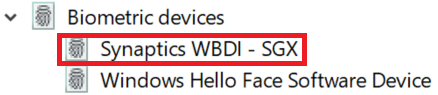

# השתמש באפשרות נעילת טביעות אצבע ב-Windows 10

**הפעל טביעת אצבע של Windows שלום**

כדי לבטל את נעילת Windows 10 באמצעות טביעת האצבע שלך, אתה צריך להגדיר Windows שלום טביעת אצבע על ידי הוספת (לאפשר לחלונות ללמוד לזהות) לפחות אצבע אחת. 

1. עבור אל **הגדרות האפשרויות הרצויות** (או לחץ [כאן](ms-settings:signinoptions?activationSource=GetHelp)). אפשרויות הכניסה הזמינות יפורטו. לדוגמה:

    

2. לחץ או הקש על **Windows שלום טביעת אצבע**ולאחר מכן לחץ על **הגדר**. בחלון שלום ההתקנה של Windows, לחץ על **התחל**. חיישן טביעת האצבע יופעל, ותתבקש להניח את אצבעך על החיישן:

   

3. בצע את ההוראות, אשר יבקש ממך לסרוק שוב ושוב את אצבעך. כאשר הדבר יסתיים, תהיה לך אפשרות להוסיף אצבעות אחרות שייתכן שתרצה להשתמש בהן עבור כניסה. בפעם הבאה שתיכנס ל-Windows 10, תהיה לך האפשרות להשתמש בטביעת האצבע שלך כדי לעשות זאת.

**Windows שלום טביעת אצבע אינה זמינה כאפשרות כניסה**

אם Windows שלום טביעת אצבע אינו מוצג כאפשרות **באפשרויות כניסה**, משמעות הדבר היא ש-Windows אינו מודע לקורא/סורק טביעות אצבע שמחובר למחשב, או שמדיניות מערכת מונעת את השימוש בה (אם לדוגמה המחשב שלך מנוהל על-ידי מקום העבודה שלך). כדי לפתור בעיות: 

1. בחר את לחצן **התחל** בשורת המשימות וחפש את **מנהל ההתקנים**.

2. לחץ או הקש כדי לפתוח את **מנהל ההתקנים**.

3. במנהל ההתקנים, הרחב את ההתקנים הביומטריים על-ידי לחיצה על הסוגר.

   

4. סורק טביעת האצבע שלך צריך להיות רשום כהתקן ביומטרי, כגון הסורק של WBDI Synaptics:

   

5. אם סורק טביעות האצבע שלך אינו מוצג, והסורק משולב במחשב האישי, עבור לאתר האינטרנט של יצרן המחשב. במקטע התמיכה הטכנית עבור מודל המחשב שלך, חפש מנהל התקן של Windows 10 עבור סורק שבאפשרותך להתקין.

6. אם הסורק נפרד מהמחשב (מחובר באמצעות USB), עבור אל אתר האינטרנט של יצרן הסורק כדי לאתר ולהתקין את תוכנת מנהל ההתקן של Windows 10 עבור מודל הסורק שיש לך.
