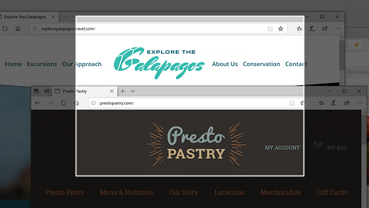
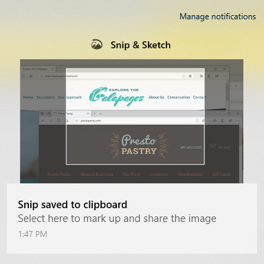

# השתמש בגזור _ Amp_ סקיצה כדי ללכוד, לסמן ולשתף תמונות

שרטוט מסך נקרא כעת **חיתוך _ Amp_ סקיצה**. **כדי לבצע חיתוך במהירות**:

1. לחץ על **מקש סמל Windows + Shift + S**. תראה את המסך שלך מהכהות והסמן מוצג כצלב. 

2. בחרו נקודה בקצה האזור שברצונכם להעתיק ולחצו על הסמן. 

3. הזז את הסמן כדי לסמן את האזור שברצונך ללכוד. האזור שתלכוד יופיע על המסך.

   

התמונה שאתה מרחרח נשמרת בלוח שלך, מוכן להדבקה בדואר אלקטרוני או במסמך. 

**אם ברצונך לערוך או להציג את התמונה**: 

- לחץ על סמל ההודעות בצד הימני הרחוק של שורת המשימות; לאחר מכן לחץ על התמונה שלכדת זה עתה. החיתוך שלך נפתח ביישום ' גזור _ Amp_ סקיצה '.

   
