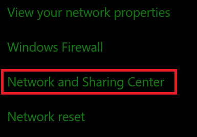
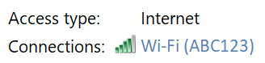
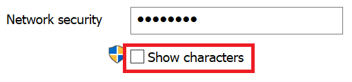

# הצגת Wi-Fi רשת ב- Windows 10View Wi-Fi network password in Windows 10

1. ודא שהמחשב שלך ב- Windows 10 מחובר לרשת Wi-Fi שלך.Make sure your Windows 10 PC is connected to the Wi-Fi network.

2. עבור אל **הגדרות > רשת & מצב >**, או לחץ או הקש כאן כדי לתת לנו לקחת אותך לשם כעת.) Go to **Settings  > Network & Internet  > Status**, or click or tap [here](ms-settings:network?activationSource=GetHelp) to let us take you there now.)

3. לחץ **על מרכז הרשת והשיתוף**.Click **Network and Sharing Center**.

    

4. במרכז **הרשת והשיתוף**, לצד **חיבורים,** תראה את שם הרשת האלחוטית שלך.In **Network and Sharing Center**, next to **Connections**, you will see the name of your wireless network. לדוגמה, אם הרשת שלך נקראת "ABC123", ייתכן ש תראה:For example, if your network is named "ABC123," you might see:

    

    לחץ על שם הרשת האלחוטית כדי לפתוח Wi-Fi מצב.Click the wireless network name to open the Wi-Fi Status window. 

5. בחלון Wi-Fi, לחץ על **מאפיינים אלחוטיים**, לחץ על **הכרטיסיה אבטחה** ובדוק את הצג **תווים**.In the Wi-Fi Status window, click **Wireless Properties**, click the **Security** tab, and check **Show characters**.

    

